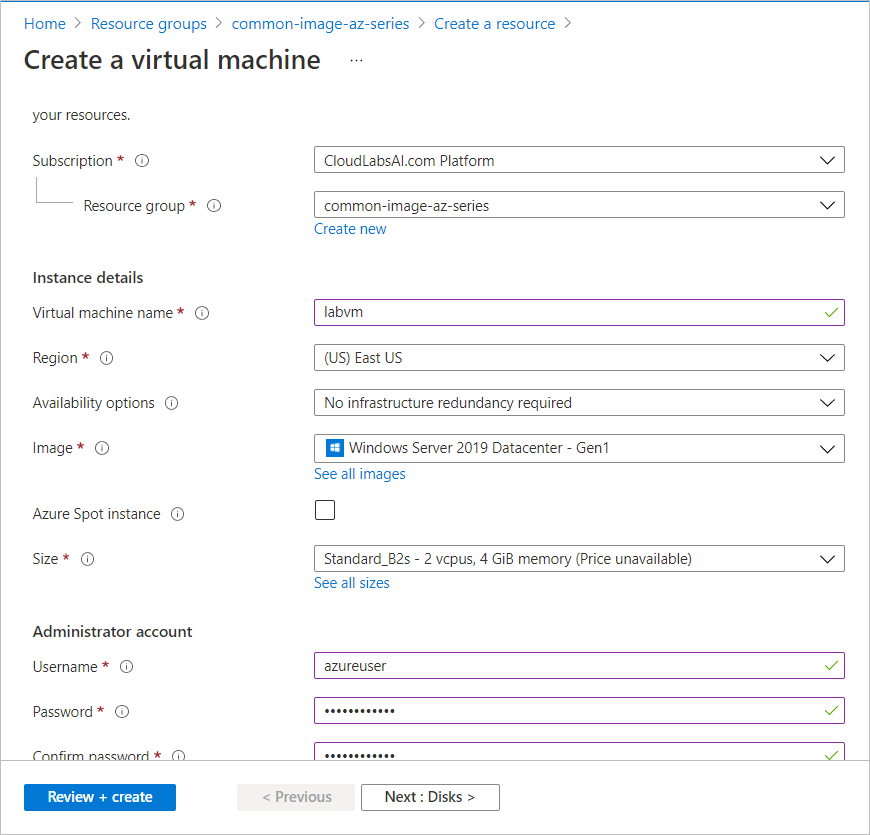
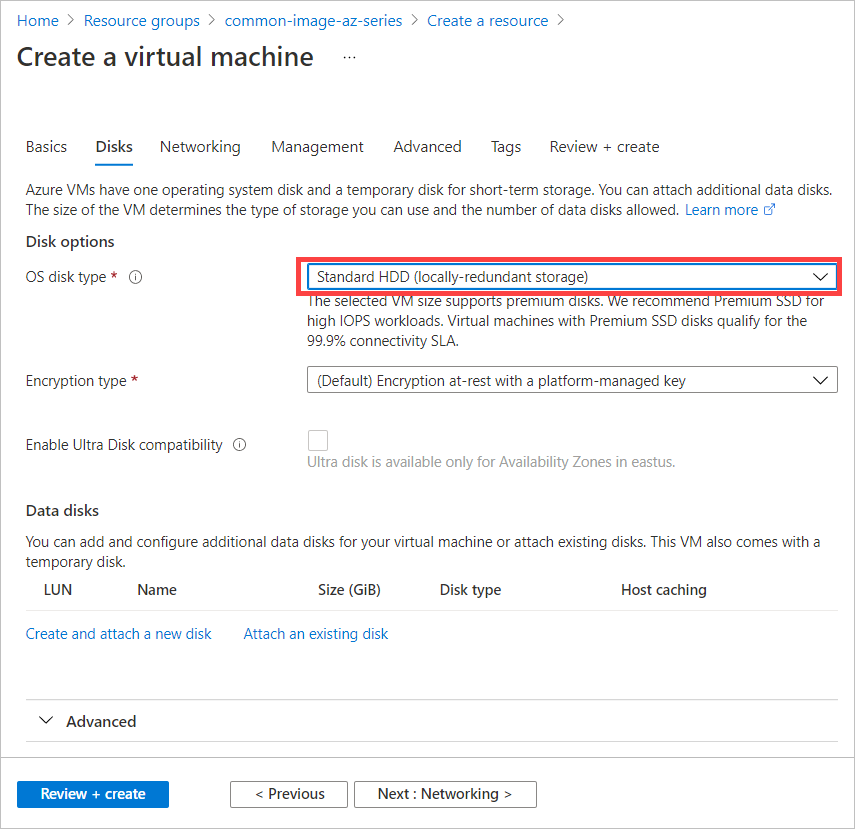
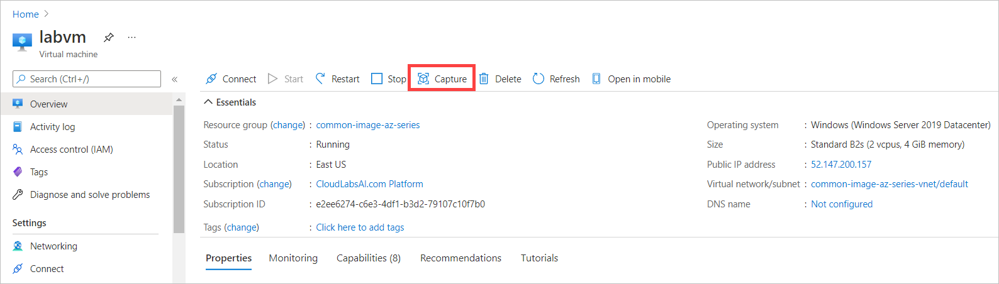
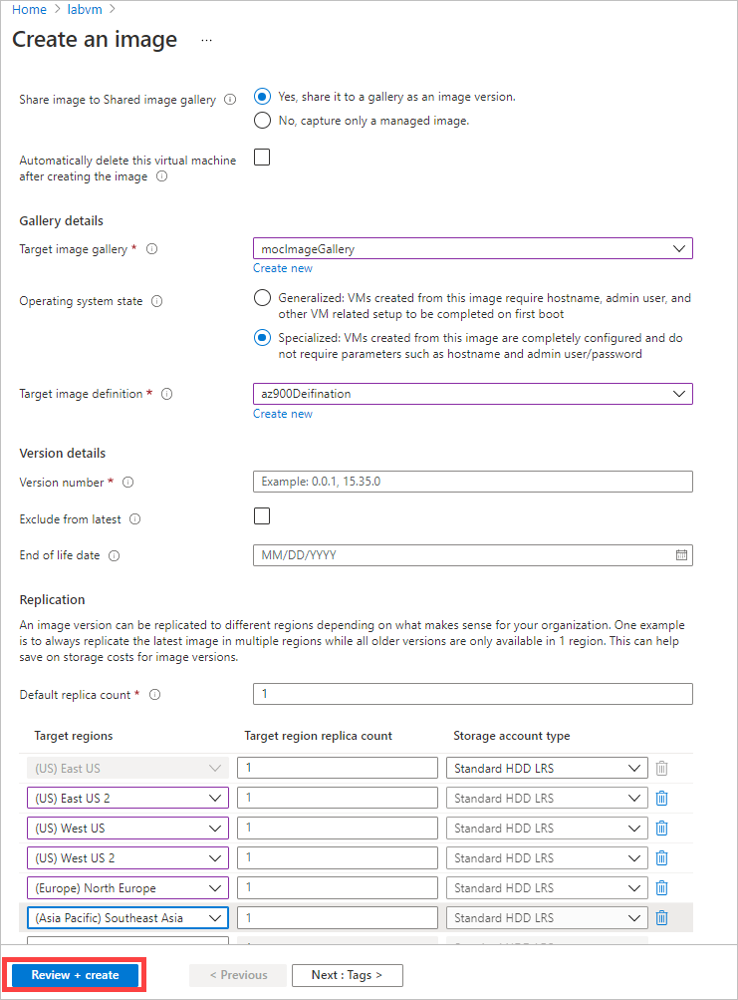
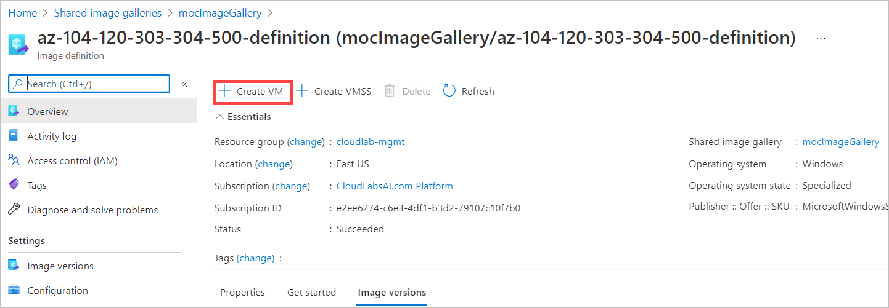

# Steps to create a shared image of a virtual machine

## Creating the vm from the azure portal

1. In the Azure portal, Go to **Virtual machines**

1. On the **Virtual machines** blade, click **+ Add** and, in the dropdown list, click **+ Virtual machine**.

1. On the **Basics** tab of the **Create a virtual machine** blade, specify the following settings (leave others with their default values):

   |Setting|Value|
   |---|---|
   |Subscription|the name of the Azure subscription you will be using in this lab|
   |Resource group|**Select your RG**|
   |Virtual machine name|**labvm**|
   |Region|**(US)East US**|
   |Image|**Windows Server 2019 Datacenter Gen 1**|
   |Size|**Standard_B2s**|
   |Username|**azureuser**|
   |Password|**Password.!!1**|
   |Public inbound ports|**Allow selected ports**|
   |Selected inbound ports| **RDP (3389)**|
   |Already have a Windows Server license|**No**|

    

1. Click **Next: Disks >** and, on the **Disks** tab of the **Create a virtual machine** blade, set the **OS disk type** to **Standard HDD** and click **Next: Networking**.

    

1. On the **Networking** tab of the **Create a virtual machine** blade, Leave default values and click on **Next**

1. Click **Next: Management >**, on the **Management** tab of the **Create a virtual machine** blade, specify the following settings

   |Setting|Value|
   |---|---|
   |Boot diagnostics|**disable**||

    

1. Click **Review + create**, on the **Review + create** blade, ensure that validation was successful and click **Create**.

1. Meanwhile open the script file named **cloudlabs-windows-functions.ps1**, Do the required changes as per the lab vm template script

1. Connect to the newly provisioned Azure VM via RDP.

1. Open the **Windows PowerShell ISE** and paste and run the custom Powershell script

1. Check whether all the required application from the script installed, and pin the applications and file explorer to the taskbar

## Create a managed image of a VM in Azure

1. In the Azure portal go to **Virtual machines** and Select the VM you want to capture the image and on the **Overview** blade click on **Capture**.

   

2. On the **Basics** tab of the **Create an image** blade, specify the following settings (leave others with their default values):

|Setting|Value|
   |---|---|
   |Subscription|the name of the Azure subscription you will be using in this lab|
   |Resource group|**Select your image gallery definition RG**|
   |Share image to Shared image gallery|**Yes, share it to a gallery as an image version.**|
   |Target image gallery|**Select the existing image gallery**|
   |Operating system state|**Specialized**|
   |Target image definition|**Create new**|

Under **Create an image definition**, specify the following settings (leave others with their default values) and click on **Ok**

|Setting|Value|
   |---|---|
   |Image definition name|**give the name as per the lab name**|
   |SKU |**Give the Unique name**|

|Setting|Value|
   |---|---|
   |Version number| **1.0.1**|
   |Default replica count| **1**|
   |Target regions|**westus, eastus, eastus2, westus2, northeurope, and southeastasia**|

   

3. Click **Review + create**, on the **Review + create** blade, ensure that validation was successful and click **Create**.

4. Delete the Virtual machine after successful creation of the image

## Creating the Virtual Machine from custom image

1. In azure portal go to **Shared image galleries**, select your Image gallery definition and click on Image definition name you created in the previous task

1. On Image definition Go to **Overview** blade Click on **Create VM** 

   

2. Now you will get redirected to Virtual Machine, Now create the vm using the custom image and test it
